# Java-Script
Basic Javascript based  applications

## CheckOutUnit
Pure Javascript
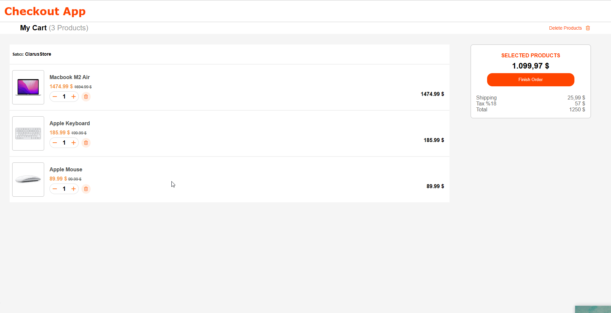

## Crypto
Pure Javascript
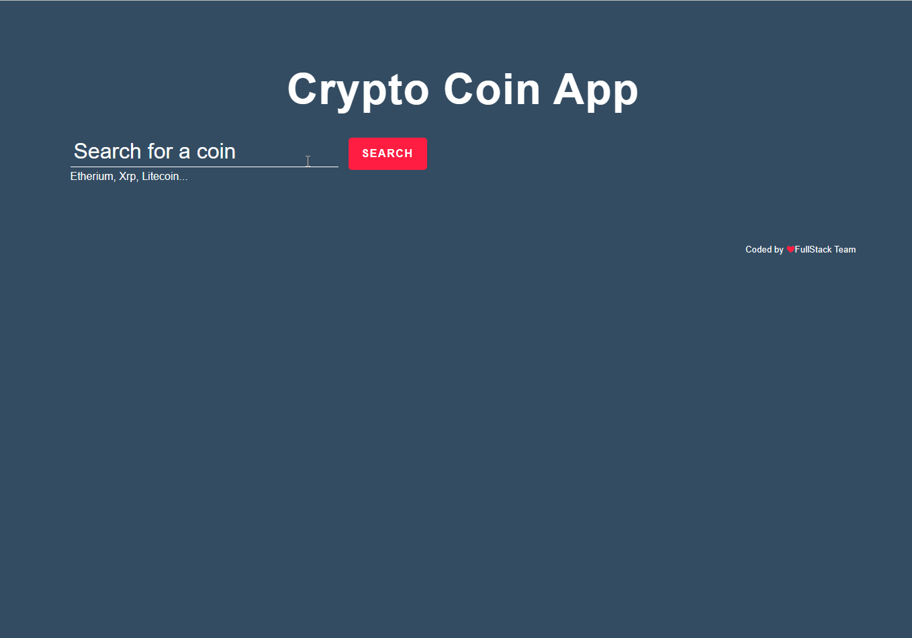

## Countries
Pure Javascript
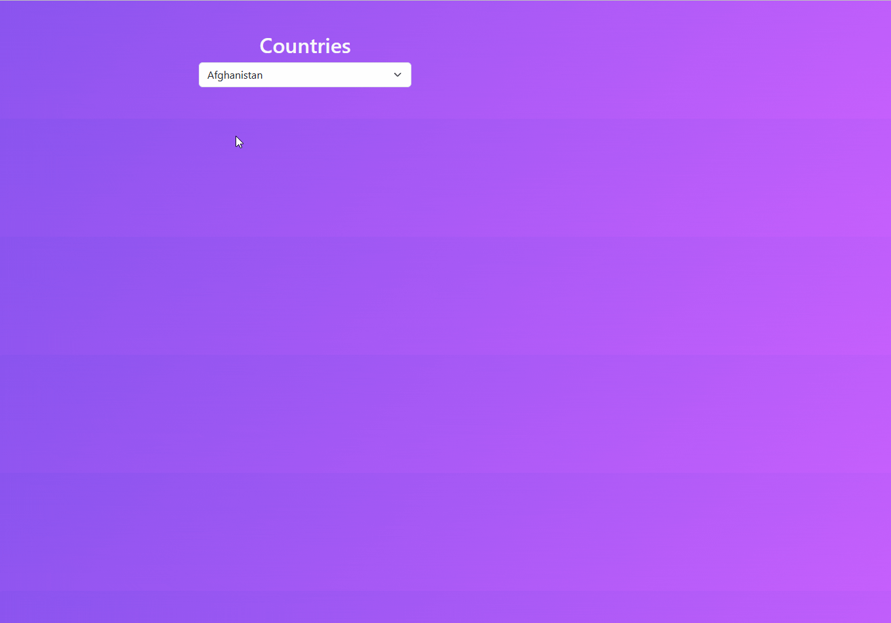

## Filtered List
Pure Javascript
Local storage is also active

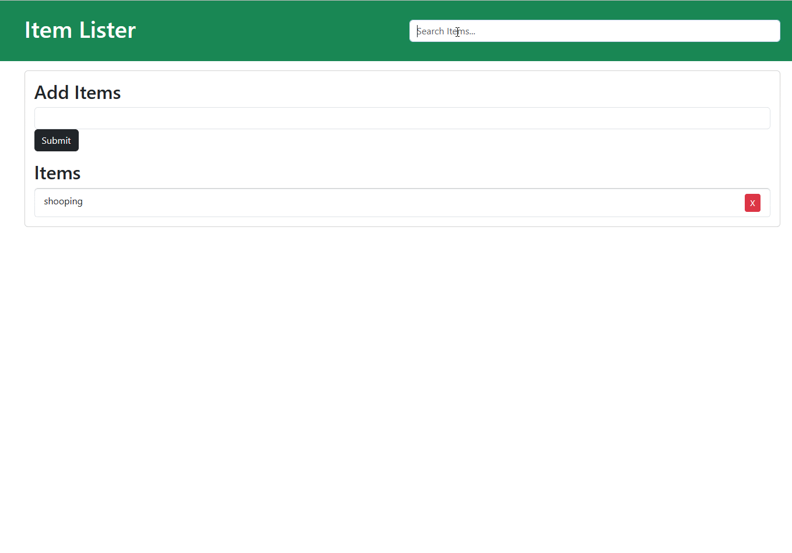

## GithubFollowers
Pure Javascript
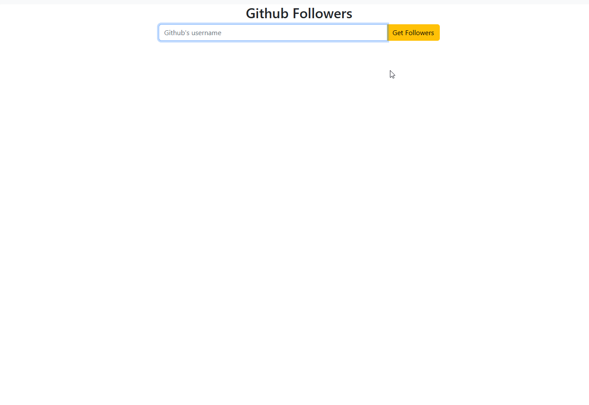

## guessTheNumber

Pure Javascript
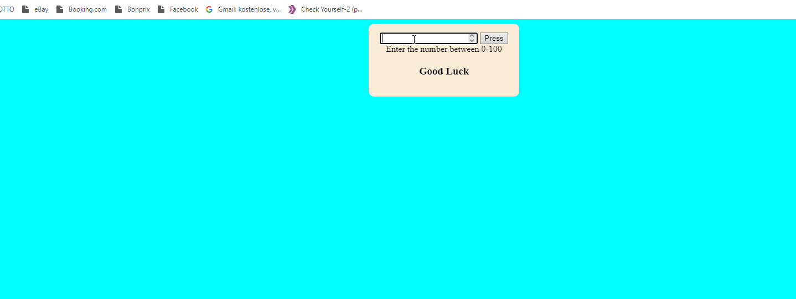

## IOS Calculator APP
Pure Javascript
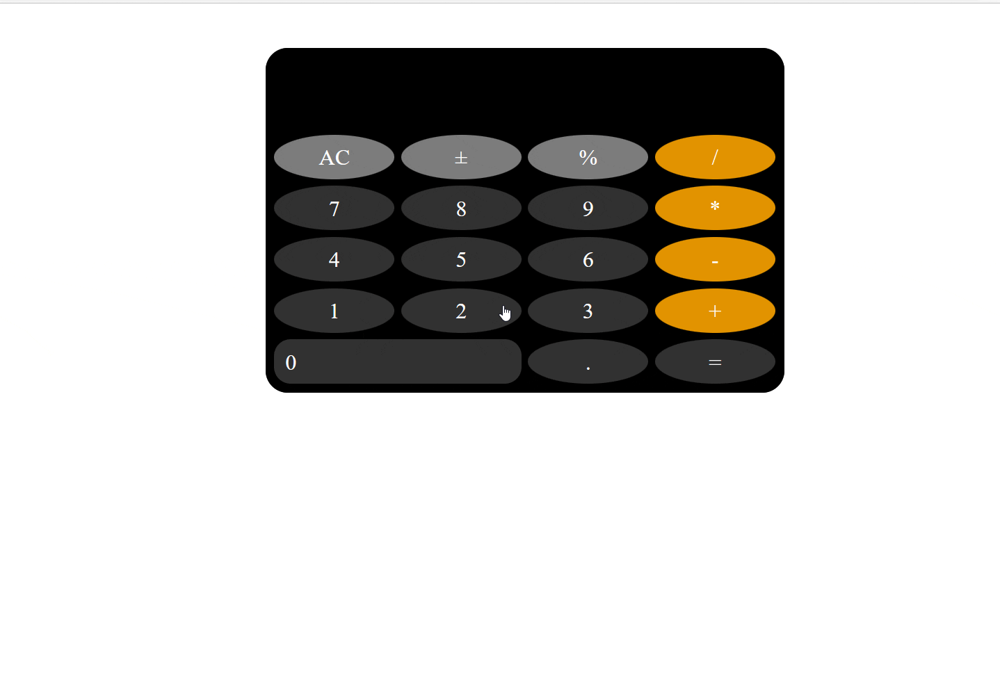

## incomeExpense app

Pure Javascript
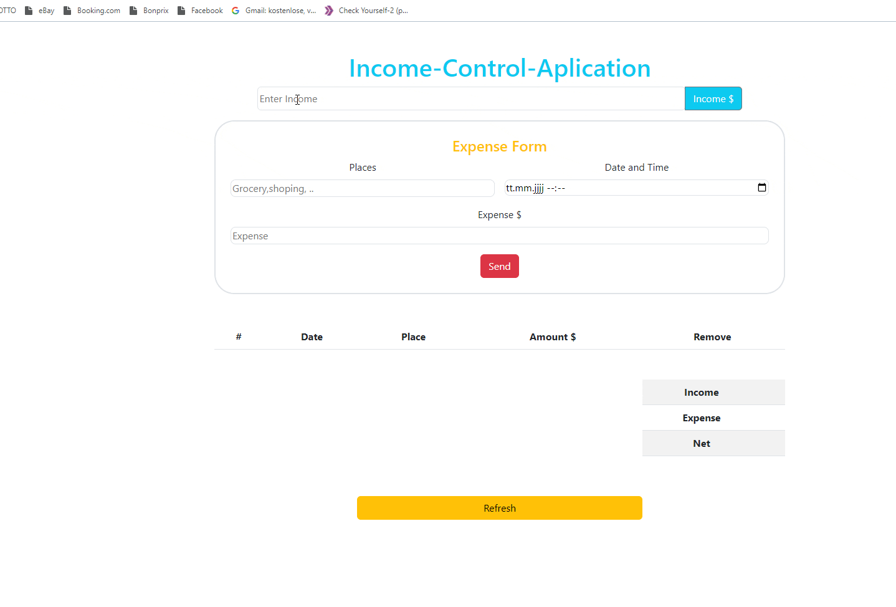

## NEWS API

Pure Javascript

## PaperRockScissors

Pure Javascript
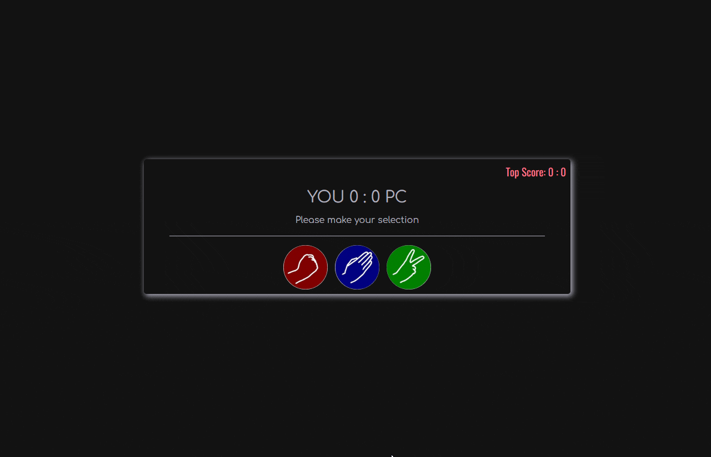

## TODO APP
There is no local storage here
Pure javascript 

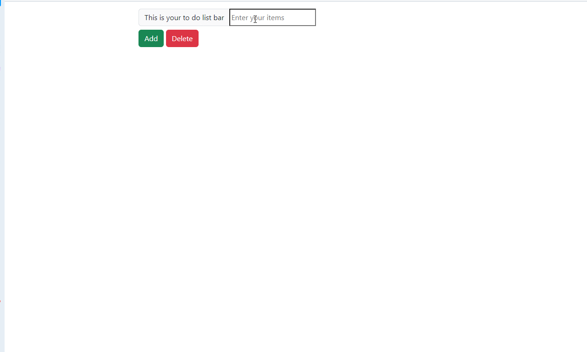

## Weather APP
Pure Javascript
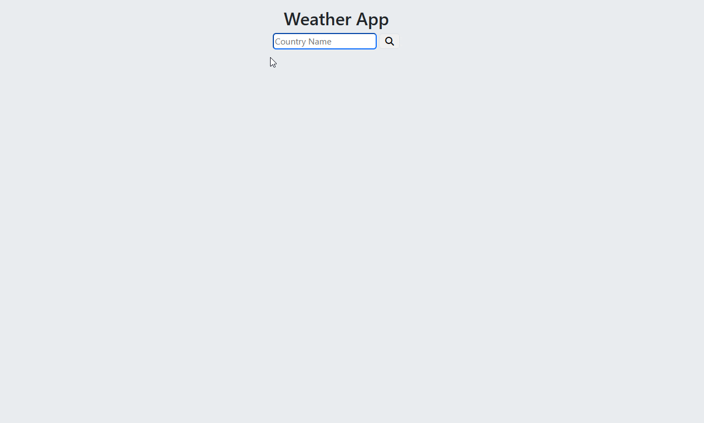

